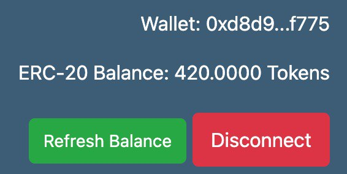
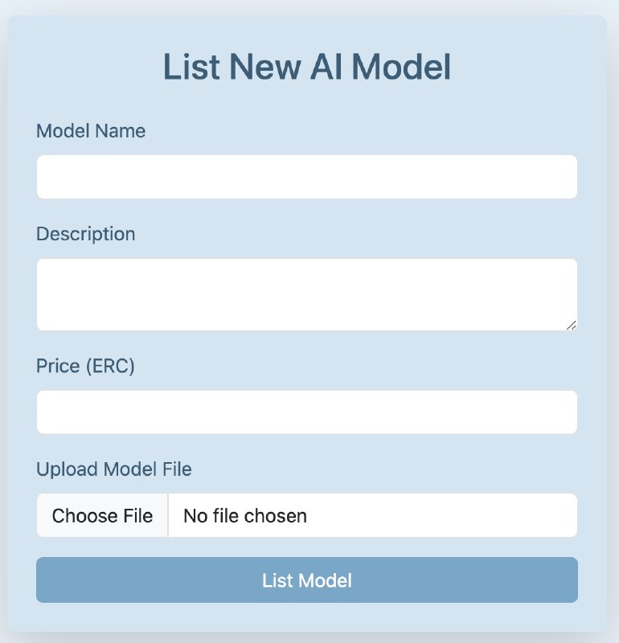
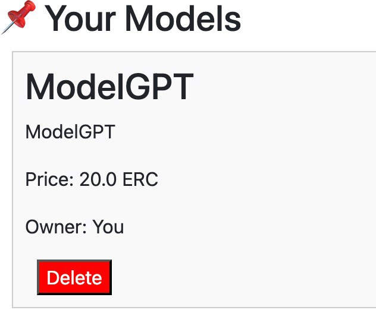
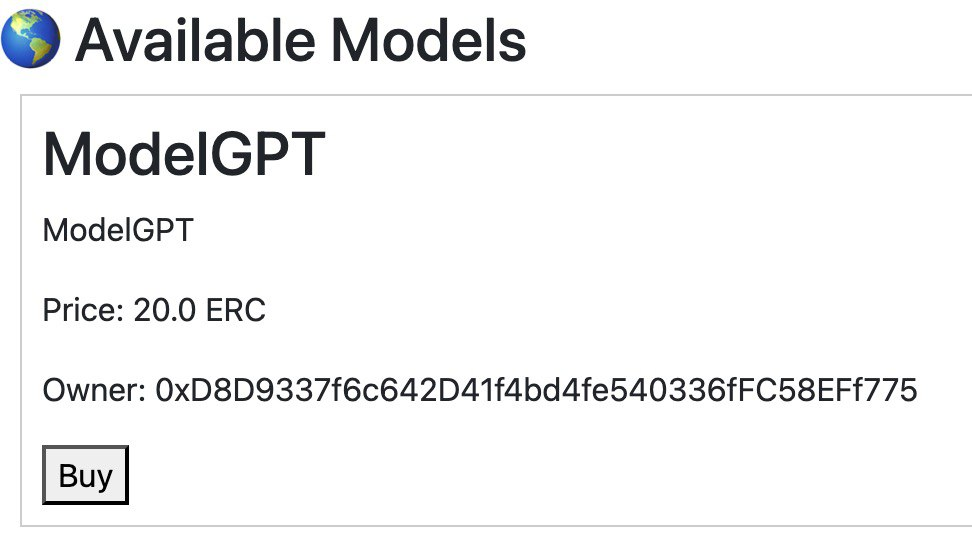
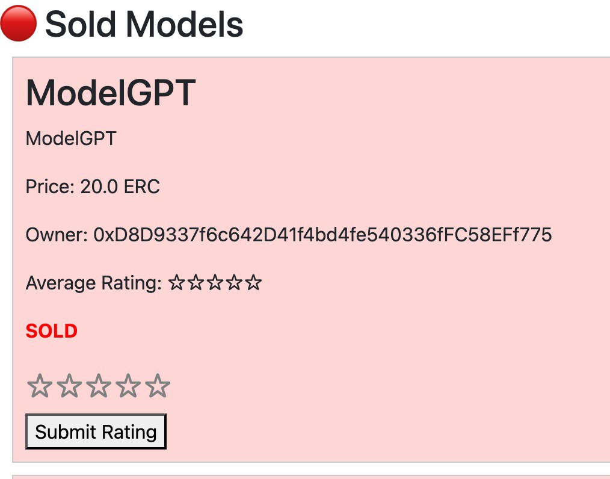

# TokenModels

TokenModels is a decentralized platform for creating, managing, and trading tokenized models. It allows users to deploy custom token contracts, manage digital assets, and interact with a marketplace using smart contracts.

## Table of Contents
- [Usage](#usage)
- [How to Use](#how-to-use)
- [Demo Screenshots](#demo-screenshots)
- [Examples](#examples)
- [Installation & Running](#installation--running)
- [Smart Contracts](#smart-contracts)
- [License](#license)

## Usage
Once the setup is complete, navigate to `http://localhost:3000` to access the frontend interface.

## How to Use
1. Open the frontend in your web browser.
2. Create or import a token model using the provided interface.
3. Configure token parameters and view real-time updates.
4. Export or deploy your token model for further use.

## Demo Screenshots











## Examples

### Example 1: Creating a Token Model
1. Click on `Create New Model` in the UI.
2. Fill in the required fields such as **Token Name, Supply, and Attributes**.
3. Click **Save** to generate the model.

### Example 2: Importing an Existing Token
1. Navigate to the `Import` section.
2. Upload a compatible token file or provide an API endpoint.
3. The system will parse and display token information for editing.

### Example 3: Exporting a Token Model
1. After configuring a model, click `Export`.
2. Choose the file format (`ZIP`).
3. Download the file for external use.

## Installation & Running

### Prerequisites
- Node.js and npm installed
- A local blockchain environment (e.g., Hardhat, Ganache, or Remix IDE for smart contract testing)

### Running the Frontend
To start the frontend application:

```bash
cd frontend/src/
npm install  # Install dependencies
npm start    # Run the application
```

## Smart Contracts

The platform includes two main smart contracts for handling tokens and marketplace transactions:

1. **AITU_SE-2318_Token.sol** - Used to deploy the token.
2. **AIModelMarketplace.sol** - Manages smart contract transactions and marketplace interactions.

### Deployment Instructions

To deploy the smart contracts, use Remix IDE and follow these steps:

1. Open Remix IDE and upload `AITU_SE-2318_Token.sol` and `AIModelMarketplace.sol`.
2. Compile each contract using the Solidity compiler.
3. Deploy them on the desired network (e.g., Ethereum testnets like Goerli, Sepolia, or a local Hardhat environment).
4. Copy the following values from Remix after deployment:
   - **CONTRACT_ADDRESS**
   - **TOKEN_ADDRESS**
   - **CONTRACT_ABI**
   - **TOKEN_ABI**
5. Update `frontend/src/config.js` with these values to connect the frontend to the deployed contracts.

## License
This project is licensed under the MIT License - see the LICENSE file for details.

For further inquiries or contributions, feel free to reach out!
